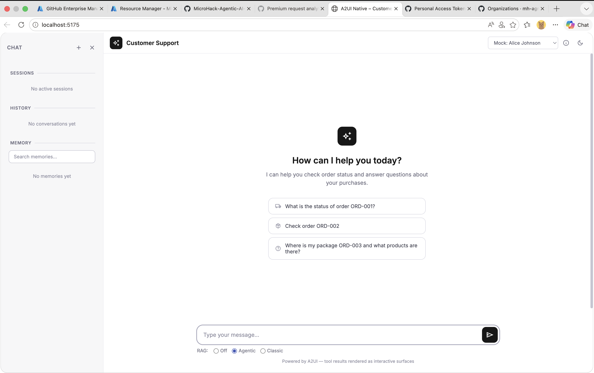

# MicroHack: Agentic AI Memory - Challenges

This MicroHack guides you through the key memory patterns used in modern agentic AI systems. Each challenge focuses on a distinct memory type — from short-lived session state to long-term knowledge retrieval — giving you hands-on experience building AI applications that remember, reason, and adapt. Work through the challenges in order, as later ones build on concepts introduced earlier.

## Prerequisites
1. Run deployment script `setup/deploy.sh` to deploy backend and frontend resources to Azure and set the `.env` file. Use your RESOURCE_GROUP and PROJECT_NAME as parameters.

```sh
setup/deploy.sh -g <RESOURCE_GROUP> -p <PROJECT_NAME>
```

Resource group is something like `rg-mhaimemk-001` and project name is something like `mhaimemk001`. (number represent your user's suffix).

> Note: this will also create an `.env` file with the necessary environment variables for local development. Check the file and make sure all values are correct.

2. Start the backend and frontend servers locally:

```sh
# Start backend server
cd backend
uv sync
uv run server.py
```

```sh
# Start frontend server
cd frontend
npm install
npm run dev
```

Navigate to frontend url `http://localhost:5173` in your browser to access the UI. 

> Note: the port might be different, check the terminal output when you start the frontend server. Also if you are using codespaces, make sure to forward the port to access the UI.

You should see the UI:



Now you're ready to start the challenges!

## Challenges

| # | Challenge | Description |
|---|-----------|-------------|
| 01 | [Session Memory (Azure Cache for Redis)](./01-session-memory/README.md) | Store and retrieve short-lived session state using Redis |
| 02 | [Conversation History](./02-conversation-history/README.md) | Persist and replay full conversation history |
| 03 | [Conversation Memory](./03-conversation-memory/README.md) | Summarise and compress long conversation threads |
| 04 | [User Memory](./04-user-memory/README.md) | Maintain per-user preferences and facts across sessions |
| 05 | [Knowledge Base (RAG via Azure AI Search)](./05-knowledge-base/README.md) | Ground responses in a searchable document knowledge base |
| 06 | [Agents Scratchpad](./06-agents-scratchpad/README.md) | Give agents working memory for multi-step reasoning |
| 07 | [Knowledge Graph](./07-knowledge-graph/README.md) | Model relationships between entities for richer recall |